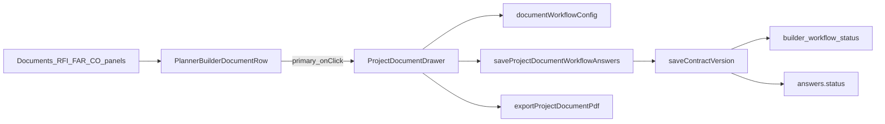

# Planner Document Drawer Workflow Report

## Summary

Saved builder documents on Planner Hub can be managed from a shared right-side **ProjectDocumentDrawer** without opening Document Builder. Primary row actions open the drawer (**View / Update**, **Review**, **View / Respond**, etc.); **Open in Builder** remains a secondary action for full editing.

## Architecture

## Status save strategy

- **Read:** `getBuilderDocumentWorkflowStatus` → `builder_workflow_status`, then `answers.status`, then lifecycle `finalized` / `archived`, else `Draft`.
- **Write:** `saveProjectDocumentWorkflowAnswers` merges drawer fields into the latest snapshot, re-assembles, calls `saveProjectDocumentDraft` with the **existing** `contract_documents.status` (`draft` | `finalized` | `archived` only).
- **Workflow column:** `extractBuilderWorkflowStatus(answers)` from merged `answers.status` → `builder_workflow_status` on save.
- Workflow labels (Submitted, Under Review, Approved, etc.) are **never** written to `contract_documents.status`.

## New / updated modules

| File | Role |
|------|------|
| `src/services/documentWorkflowConfig.ts` | Per-type status options, primary button labels, drawer meta, field sections |
| `src/services/documentWorkflowConfig.test.ts` | Config unit tests |
| `src/services/builderWorkflowStatus.ts` | `getBuilderDocumentWorkflowStatus` alias |
| `src/services/exportProjectDocumentPdf.ts` | Central PDF routing for all builder types |
| `src/components/planner/ProjectDocumentDrawer.tsx` | Shared drawer UI |
| `src/components/planner/documents/plannerDocumentFormat.ts` | Display formatting helpers |
| `src/components/planner/documents/projectDocumentDrawerExtras.tsx` | RFI/FAR impact sections |
| `src/components/planner/documents/BuilderDocumentReviewDrawer.tsx` | Thin wrapper → `ProjectDocumentDrawer` |

## Document-specific drawer fields

Configured in `getDocumentWorkflowFieldSections` — read-only key details + editable notes/response fields per type (submittal reviewer comments, daily `qcNotes`, QC deficiencies, warranty closeout, punch list, RFI response, FAR review, change order `terms`, contract notes).

RFI/FAR retain extra **Impact / References** sections via `projectDocumentDrawerExtras.tsx`.

## Pages / panels updated

- **Documents:** Contracts, Submittals, Daily Reports, QC Reports, Punch Lists, Closeout — drawer state + `onOpenDrawer` on builder rows / contracts table.
- **RFIs / FARs:** `ProjectDocumentDrawer` replaces direct review drawer usage; builder rows use config-driven primary labels.
- **Change orders:** Builder draft rows open drawer; legacy CO rows unchanged (**Open / Edit**).

## Row action pattern

| Primary | Secondaries |
|---------|-------------|
| View / Update, Review, View / Respond, View / Review (by type) | Open in Builder, Export PDF |
| Delete | Draft sections only (unchanged) |

## Validation

| Command | Result |
|---------|--------|
| `npm test` | **254 passed** (41 files) |
| `npm run build` | **Success** (Vite production build) |
| `npx tsc -p tsconfig.app.json --noEmit` | Pre-existing repo debt may remain outside new files |

## Known limitations

- Documents tab lists stay flat for most types; only status badges refresh after save (RFI/FAR partitions unchanged).
- Drawer edits a workflow subset; full content edit is still in Document Builder.
- Legacy RFI/FAR/CO database rows keep their existing actions and drawers.
- Safety Meetings and QC checklist (non-builder) rows are unchanged.
- Residential contract `contractNotes` may be empty unless captured in the pack; display uses available answer keys.

## Out of scope

Supabase schema, `contract_documents.status` enum, auth/RLS, Document Builder full-edit flow, pricing.
