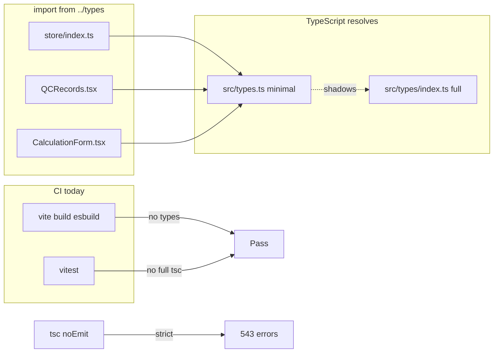

# Type Model Drift Audit (Read-Only)

**Date:** 2026-06-03  
**Command:** `npx tsc -p tsconfig.app.json --noEmit`  
**Result:** **543 errors** (exit code 2)  
**Contrast:** `npm run build` and `npm test` both pass (196 tests)

---

## Executive summary

TypeScript reports hundreds of errors because **the repo almost never runs the typechecker in CI or build**, and because **`src/types.ts` shadows `src/types/index.ts`** for the majority of app imports. Runtime code was extended against the rich models in `src/types/index.ts` and feature modules (`src/types/proposal.ts`, `src/types/scheduleEvent.ts`, etc.), while `tsc` still resolves many imports to a **legacy, minimal** `src/types.ts` (682 lines of pricing catalog + slim `Project` / `Calculation` / `UserPreferences`).

Vite (`npm run build`) transpiles with esbuild only — **no `tsc` step**. Vitest runs a subset of tests and does not typecheck the full `src` tree. ESLint uses `typescript-eslint` recommended rules but **not** `parserOptions.project` / type-aware linting, so structural drift is invisible to `npm run lint`.

---

## Root cause (primary)

### Module resolution: `types.ts` wins over `types/index.ts`

When code does:

```ts
import { Project, QCRecord } from '../types';
```

TypeScript resolves `src/types.ts` **before** `src/types/index.ts`. Evidence:

| Symbol | In `src/types/index.ts` | In `src/types.ts` | `tsc` when importing `../types` |
|--------|---------------------------|-------------------|----------------------------------|
| `Project.placementOrder` | yes | no | **error TS2339** |
| `Project.clientInfo` | yes | no | **error TS2353** |
| `Project.qcRecords` | yes | no | **error TS2339** |
| `QCRecord` / `QCRecordType` | yes | **not exported** | **error TS2305** (11 sites) |
| `Calculation.psi` | yes | no | **error TS2339** |
| `Calculation.result.pricing` | yes (optional) | no | **error TS2339** |
| `UserPreferences` (full) | yes (12+ fields) | 3 fields only | **error TS2339** `volumeUnit` |

`src/types.ts` line 1 is also suspect:

```ts
import { LengthUnit, VolumeUnit } from './types';
```

From inside `types.ts`, `./types` cannot mean the same file; resolution falls through to the **`types/` directory**, creating a confusing split brain (legacy file + folder).

### Root cause (secondary)

1. **`PreferencesState` in `src/store/index.ts`** declares a **local** `preferences` shape (only `autoSave`, `notifications`, `soundEnabled`, `hapticsEnabled`) instead of `UserPreferences`. Even after fixing module shadowing, the store would still disagree with components reading `preferences.volumeUnit` until `PreferencesState` uses `UserPreferences`.

2. **`defaultPreferences` in store** is typed as imported `UserPreferences` from shadowed `../types` (3-field legacy), then assigned 12 fields → **TS2353** on `measurementSystem`, etc.

3. **Real domain drift** (not shadowing): tests and editors build partial objects that do not satisfy stricter interfaces.

---

## Why build and tests pass

| Pipeline | Typechecks? | Notes |
|----------|-------------|--------|
| `vite build` | No | `isolatedModules` + esbuild emit; types erased at compile time |
| `vitest run` | No (full tree) | Executes tests; only `.test.ts` files that import bad fixtures fail under `tsc`, not under vitest |
| `npm run lint` | No (project-aware) | No `project: ['./tsconfig.app.json']` in eslint config |
| `tsc -p tsconfig.app.json --noEmit` | **Yes** | Strict + `noUnusedLocals` / `noUnusedParameters` → **187× TS6133** alone |

`tsconfig.app.json` is strict (`strict: true`) but is **not wired into `package.json` scripts**.

---

## Error budget (543 total)

| Code | Count | Category |
|------|-------|----------|
| TS6133 | 187 | Unused imports/locals (`noUnusedLocals`) — noise, not domain drift |
| TS2339 | 192 | Property does not exist on type — **mostly shadowing + store prefs** |
| TS2353 | 23 | Excess properties on object literals |
| TS2322 | 20 | Assignability (null/undefined, partial mocks) |
| TS2739 | 9 | Missing required properties |
| TS2305 | 11 | Missing exports (`QCRecord`, `ReinforcementSet`, …) |
| Other | ~101 | TS2345, TS7006, TS18047, TS6196, etc. |

After fixing module shadowing and store `PreferencesState`, expect **~200+ errors to disappear**; TS6133 can be addressed separately or relaxed.

---

## Focus area 1: Project type drift

### Canonical definition

**`src/types/index.ts`** — `Project` includes:

- `clientInfo?: ProjectClientInfo`
- `reinforcements?: ReinforcementSet[]`
- `laborEstimates?: LaborEstimate[]`
- `placementOrder?: PlacementOrder`
- `mixProfile?: MixProfileType`
- `qcRecords?: QCRecord[]`
- `customEstimates?: ProjectCustomEstimates`
- `truckTickets`, contract value fields, etc.

### Legacy shadow (`src/types.ts`)

```ts
export interface Project {
  id, name, description, jobsiteAddress?, createdAt, updatedAt,
  calculations, wasteFactor?, pourDate?
}
```

### Symptom files (sample — all import `../../types` or `../types` → legacy)

- `src/store/index.ts` — entire project CRUD, QC, labor, placement, truck tickets
- `src/components/calculations/PricingCalculator.tsx` — `placementOrder`
- `src/components/calculators/ProjectCalculatorShell.tsx` — `clientInfo`
- `src/components/calculators/GeneralTradeLaborCalculatorPanel.tsx` — `customEstimates`
- `src/components/projects/PlacementOrderStatusPanel.tsx`
- `src/components/dashboard/ActiveProjectsPanel.tsx`
- `src/components/pour-planner/PourOrderSection.tsx`
- `src/pages/Projects/*`, `src/utils/workflow*.ts`, `src/utils/placement*.ts`

### Exact additions if legacy file were kept (not recommended)

Would require duplicating the full `Project` block from `index.ts` into `types.ts` — **do not do this**. Merge into one barrel instead.

---

## Focus area 2: QC type exports

### Canonical

**`src/types/index.ts`:**

- `export type QCRecordType = 'fresh_test' | 'break_test'`
- `export interface QCRecord { ... }`
- `export interface QCChecklist { ... }`

### Shadow problem

Importers use `from '../types'` / `from '../../types'` → **`src/types.ts`**, which exports **no** `QCRecord`.

**TS2305 sites:**

- `src/store/index.ts`
- `src/components/projects/QCRecords.tsx`
- `src/pages/Projects/useProjects.ts`
- `src/utils/qcRecordDb.ts`
- `src/utils/projectFolders.ts`
- `src/utils/concreteTruckTicket.ts`
- `src/utils/truckTicketDb.ts`

### Fix (type-only)

After shadowing fix, re-export from barrel:

```ts
// in src/types/index.ts (already defined inline — ensure barrel is the import target)
export type { QCRecord, QCRecordType, QCChecklist };
```

No schema change; runtime `mapQcRecordFromDb` in store is already correct.

---

## Focus area 3: Calculation type drift

### Canonical (`src/types/index.ts`)

```ts
export interface Calculation {
  ...
  result: {
    volume: number;
    bags: number;
    pricing?: { concreteCost; pricePerYard; deliveryFees; ... };
  };
  psi?: string;
  mixProfile?: MixProfileType;
  quikreteProduct?: { type; weight; yield };
  mixDesignApproval?: MixDesignApproval;
  ...
}
```

### Legacy (`src/types.ts`)

```ts
result: { volume; bags; recommendations: string[] };  // no pricing
// no top-level psi, mixProfile, quikreteProduct
mixDesign?: ConcreteMixDesign;  // different shape than index
```

### Symptom files

- `src/components/calculations/CalculationForm.tsx` — `psi`, `result.pricing`
- `src/store/index.ts` — persist/load calculation fields

### Exact additions (if staying on one canonical module)

Already present in `index.ts`. **Move** from legacy file only if still needed elsewhere:

- `ConcreteMixDesign`, `CONCRETE_MIX_DESIGNS` → `src/types/mixDesign.ts` (re-export from index)
- Keep `result.pricing` optional for bag-only calcs

---

## Focus area 4: UserPreferences / `volumeUnit`

### Canonical (`src/types/index.ts`)

Full preference model: `units`, `lengthUnit`, `volumeUnit`, `measurementSystem`, `currency`, `defaultPSI`, `autoSave`, `soundEnabled`, `hapticsEnabled`, expanded `notifications`.

### Legacy (`src/types.ts`)

```ts
export interface UserPreferences {
  units: Unit;
  lengthUnit: LengthUnit;
  volumeUnit: VolumeUnit;
}
```

### Store double drift

`src/store/index.ts` `PreferencesState`:

```ts
preferences: {
  autoSave; notifications { 3 keys }; soundEnabled; hapticsEnabled;
};  // missing volumeUnit, units, lengthUnit, ...
```

`userPreferencesService.ts` correctly uses `UserPreferences` from `../types` (shadowed legacy for import type, but service defines `DEFAULT_USER_PREFERENCES` with full shape → assignability errors against store slice).

### Symptom files

- Pour planner steps, `LaborCalculatorPanel`, `CalculationForm`, `OverviewSummaryCard` — read `preferences.volumeUnit` from Zustand

---

## Focus area 5: ProposalData — `terms`, `preparedBy`

### Canonical

**`src/types/proposal.ts`:**

```ts
terms: string;        // required
preparedBy: string;   // required
```

Runtime normalization in `src/lib/proposalService.ts` defaults both to `''`.

### Drift (real, not shadowing)

Partial literals in tests/editors omit required fields → **TS2739**:

| File | Issue |
|------|--------|
| `src/components/proposals/ProposalPricingEditor.tsx` | Default pricing object missing `terms`, `preparedBy` |
| `src/utils/proposalPricing.test.ts` | Multiple fixtures |
| `src/utils/changeOrderFinancials.test.ts` | Proposal fixture |
| `src/utils/proposalPricing.test.ts` | Legacy `pricing[]` migration test without terms |

### Safest type fix options (later)

1. Add `createEmptyProposalData(): ProposalData` helper with `terms: ''`, `preparedBy: ''`.
2. Or make `terms?` / `preparedBy?` optional in type **only if** all readers use `?? ''` (weaker).

**Do not** change DB JSON schema for proposals.

---

## Focus area 6: ScheduleEvent — `recurrenceRule`

### Canonical

**`src/types/scheduleEvent.ts`:**

```ts
recurrenceRule: RecurrenceRule | null;  // required key, null allowed
```

`ScheduleEventInput` allows `recurrenceRule?: RecurrenceRule | null` (optional on input).

### Drift

**`src/utils/scheduleEventUtils.test.ts`** — `mockEvent()` spread omits `recurrenceRule` → type is `undefined` → **TS2322**:

> `undefined` is not assignable to `RecurrenceRule | null`

### Fix (later)

Add to mock: `recurrenceRule: null` (one line in test helper). Production mappers should normalize `undefined` → `null` when building `ScheduleEvent`.

---

## Duplicate / conflicting type files

| Path | Role | Conflict |
|------|------|----------|
| **`src/types.ts`** | Legacy pricing catalog + minimal Project/Calculation/UserPreferences | **Shadows `src/types/` folder** |
| **`src/types/index.ts`** | Canonical app domain models | Should be default `../types` target |
| **`src/types/*.ts`** | Focused modules (proposal, schedule, placement, changeOrder, …) | Correct pattern; import directly or via barrel |
| **`src/features/documents/types.ts`** | Document engine only | **Separate domain** — not a bug; `../../types` from `features/documents/*` resolves here, not `src/types.ts` |
| **`src/features/documents/registry/types.ts`** | Registry helpers | Nested; no conflict with app types |

**Import pattern today:**

- ~**110** files use `from '../types'` or `from '../../types'` (many under `features/documents` → engine types).
- ~**4** files correctly use `from '../types/index'` (`changeOrderDocumentContext`, `ReinforcementDetails`, `placementProduction`, `calculationDimensions`).

---

## Canonical type file recommendation

1. **Remove or rename `src/types.ts`** so it no longer participates in `import '../types'` resolution.
   - Preferred: move `LOCATION_PRICING`, `LocationPricing`, `ConcretePricing`, `ConcreteMixDesign`, `CONCRETE_MIX_DESIGNS`, and legacy `Weather` types to **`src/types/pricingCatalog.ts`** (or `locationPricing.ts`).
2. **`src/types/index.ts`** becomes the **single barrel** for app-wide imports:
   - Re-export domain modules: `export * from './proposal'`, `export * from './scheduleEvent'`, etc., as needed.
   - Keep inline definitions for `Project`, `Calculation`, `QCRecord`, `UserPreferences`, `ReinforcementSet` OR split into `project.ts` / `calculation.ts` and re-export (optional cleanup).
3. Optional: add path alias in `tsconfig.app.json`:

   ```json
   "paths": { "@/types": ["./src/types/index.ts"], "@/types/*": ["./src/types/*"] }
   ```

4. **Never** add a new top-level `src/types.ts` after removal.

---

## Exact type additions / moves (checklist)

### A. Resolve shadowing (highest leverage)

- [ ] Relocate legacy `src/types.ts` content to `src/types/pricingCatalog.ts` (+ `weather.ts` if needed).
- [ ] Delete or replace `src/types.ts` with nothing (no duplicate file).
- [ ] Extend `src/types/index.ts` barrel:

  ```ts
  export * from './pricingCatalog';
  export type { ProposalData } from './proposal';
  export type { ScheduleEvent, ScheduleEventInput, RecurrenceRule } from './scheduleEvent';
  // ... other modules used via '../types'
  ```

### B. Store alignment

- [ ] `PreferencesState.preferences` → `UserPreferences` (import from `../types/index` or fixed barrel).
- [ ] Remove duplicate inline notification shape; use `UserPreferences['notifications']`.

### C. Project / Calculation / QC

- [ ] **No new fields needed** on canonical interfaces — already complete in `index.ts`.
- [ ] Fix imports only (or barrel), except store Supabase row typing (separate `any` issues).

### D. ProposalData

- [ ] Add shared factory `emptyProposalData()` with `terms: ''`, `preparedBy: ''`.
- [ ] Update test fixtures and `ProposalPricingEditor` default state.

### E. ScheduleEvent

- [ ] `mockEvent`: `recurrenceRule: null`.
- [ ] Optional: mapper `recurrenceRule: row.recurrence_rule ?? null` audit in `scheduleEventService`.

### F. Pricing-only consumers

- [ ] Update `readyMixCost.ts`, `supplierPricing.ts`, `calculations.ts`, `PricingCalculator.tsx` to import `LocationPricing` from barrel or `types/pricingCatalog`.

---

## Files affected (grouped)

### Tier 1 — blocked on `../types` → `types.ts` shadow (~60–70 app files)

All under `src/` (excluding `features/documents`) that import `Project`, `Calculation`, `UserPreferences`, `QCRecord`, `LocationPricing` from `../types` or `../../types`.

High-impact:

- `src/store/index.ts`
- `src/services/userPreferencesService.ts`
- `src/components/calculations/*`
- `src/components/calculators/*`
- `src/components/projects/*`
- `src/components/pour-planner/**`
- `src/pages/Projects/**`, `src/pages/Settings.tsx`, `src/pages/CalculatorHub.tsx`
- `src/utils/calculations.ts`, `readyMixCost.ts`, `supplierPricing.ts`, `workflow*.ts`, `placement*.ts`, `pour*.ts`

### Tier 2 — store-local type overrides

- `src/store/index.ts` (`PreferencesState`, Supabase `any` mappers)

### Tier 3 — real interface strictness (not shadowing)

- `src/components/proposals/ProposalPricingEditor.tsx`
- `src/utils/proposalPricing.test.ts`, `proposalKpis.test.ts`, `changeOrderFinancials.test.ts`
- `src/utils/scheduleEventUtils.test.ts`

### Tier 4 — unused code noise (187 errors)

- Widespread `React` unused import, planner/dashboard components — **TS6133**

### Not affected by app type shadowing

- `src/features/documents/**` importing `../../types` → **`features/documents/types.ts`**
- Direct imports: `../types/proposal`, `../types/scheduleEvent`, `../types/changeOrder` (already correct)

---

## Safest fix order

1. **Stop the bleeding:** rename/move `src/types.ts` → `src/types/pricingCatalog.ts`; ensure no file named `src/types.ts` remains.
2. **Barrel:** expand `src/types/index.ts` re-exports (pricing + any symbols currently only in legacy file).
3. **Smoke `tsc`:** expect TS2305/2339/2353 on Project/QC/Calculation to drop sharply.
4. **Store:** align `PreferencesState` with `UserPreferences`; fix `defaultPreferences` typing.
5. **Proposal tests/editor:** add `terms` / `preparedBy` to fixtures or factory helper.
6. **Schedule test:** `recurrenceRule: null` in `mockEvent`.
7. **CI script (optional):** `"typecheck": "tsc -p tsconfig.app.json --noEmit"` — do not block build until error count is manageable.
8. **TS6133 cleanup last** (or disable `noUnusedLocals` temporarily for incremental adoption).

---

## What not to touch

- **Supabase migrations / RLS** — audit is types-only.
- **Runtime business logic** in services (RFI, change orders, documents) unless a change is required for typing (prefer type-only fixes first).
- **`src/features/documents/types.ts`** — separate engine; do not merge with app `Project`.
- **Vite / PWA / bundle config** — except optionally adding a non-blocking `typecheck` script.
- **Broad `any` removal in store Supabase mappers** — follow-up; not required for shadowing fix.
- **Making `ProposalData.terms` optional** without updating PDF/UI defaults — would hide real bugs.
- **Planner `fieldPlanner` types** — already in `src/types/fieldPlanner.ts`; no change needed for this audit.

---

## Verification commands (after future fixes)

```bash
npx tsc -p tsconfig.app.json --noEmit
npm test
npm run build
```

Target: `tsc` exit 0 (or agreed error budget with TS6133 deferred).

---

## Summary diagram



**Bottom line:** Tests and build pass because they do not enforce the type graph. The canonical models in `src/types/index.ts` match runtime behavior; **`src/types.ts` module shadowing** is the main reason `tsc` reports hundreds of false “missing property” errors, compounded by store-local `PreferencesState`, strict proposal/schedule fixtures, and `noUnusedLocals` noise.
