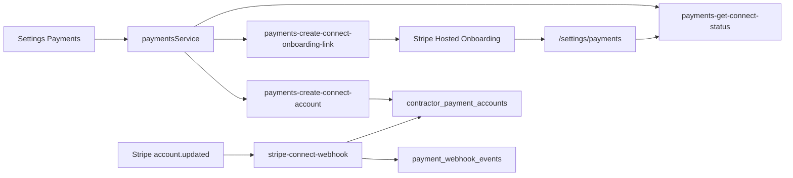

# Arden Payments - Phase 0 and Phase 1 Implementation Plan

Status: Review-only implementation plan. Do not implement code, database migrations, Edge Functions, Stripe Dashboard changes, UI changes, or secrets from this document until it is reviewed and approved.

Scope: Phase 0 decisions and Phase 1 optional contractor Stripe connection + reliable account-status synchronization only.

Non-goals for Phase 0/1:

- No proposal snapshots.
- No invoices.
- No payment schedules.
- No client payment links.
- No Stripe invoice emails.
- No project balance calculations.
- No manual payment tracking.
- No refunds.
- No A/R reporting.
- No QuickBooks export.
- No payment entitlements.
- No payment collection UI.

Hard preservation boundary: do not modify existing Arden subscription checkout, existing `stripe-webhook`, `subscriptions`, proposal email delivery, proposal acceptance, public proposal tokens, contracts, change orders, or client portal behavior.

---

## 1. Phase 0 / 1 Goal

The first implementation milestone is only:

```text
Settings -> Payments
-> optional Stripe Connect account creation
-> Stripe-hosted onboarding link
-> return to Arden
-> account status refresh
-> account.updated webhook sync
```

The result should prove that a contractor company can optionally connect Stripe and that Arden can reliably display account state (`charges_enabled`, `payouts_enabled`, requirements/action-needed status) without touching subscription billing or proposal workflows.



---

## 2. Current-State Files/Services Phase 1 Will Touch

These are proposed touchpoints only; this document does not make the changes.

### 2.1 New files expected

- `src/pages/PaymentsSettingsPage.tsx`
- `src/components/settings/PaymentsConnectPanel.tsx` (or equivalent)
- `src/services/paymentsService.ts`
- `src/lib/contractorPaymentAccountTypes.ts`
- `src/services/__tests__/paymentsService.test.ts`
- `src/pages/__tests__/PaymentsSettingsPage.test.tsx` (or component-level equivalent)
- `supabase/migrations/<timestamp>_contractor_payment_accounts.sql`
- `supabase/migrations/<timestamp>_payment_webhook_events.sql` (or combined with the account migration)
- `supabase/functions/payments-create-connect-account/index.ts`
- `supabase/functions/payments-create-connect-onboarding-link/index.ts`
- `supabase/functions/payments-get-connect-status/index.ts`
- `supabase/functions/stripe-connect-webhook/index.ts`
- `supabase/functions/_shared/stripeConnect.ts` (new Connect-specific helpers; do not extend subscription `_shared/stripe.ts`)

### 2.2 Existing files likely modified

- `src/pages/Settings.tsx` - add a `SettingsLinkSection` to `/settings/payments`.
- `src/routes/lazyPages.tsx` - add `LazyPaymentsSettingsPage`.
- `src/App.tsx` - add `/settings/payments` route using the existing authenticated company owner/admin route pattern.
- `supabase/config.toml` - add `[functions.stripe-connect-webhook] verify_jwt = false`.
- `.env.example` - document `STRIPE_CONNECT_WEBHOOK_SECRET` only; do not add real secrets.
- `src/pages/__tests__/Settings.test.tsx` - assert Payments settings link.
- `src/pages/__tests__/security.test.ts` - add route-guard coverage if it is the existing security-route convention.

### 2.3 Existing patterns to mirror

- Settings link-out pattern: `src/pages/Settings.tsx`, `src/components/settings/SettingsCollapsibleSection.tsx`, `src/pages/BillingPage.tsx`.
- Lazy route pattern: `src/routes/lazyPages.tsx`, `src/App.tsx`.
- Auth/CORS pattern for Edge Functions: `supabase/functions/_shared/requireAuth.ts`, `supabase/functions/_shared/cors.ts`.
- Webhook signature pattern: `supabase/functions/stripe-webhook/index.ts`, but do not add Connect logic there.
- Server-write-only RLS pattern: `supabase/migrations/20260717120000_subscriptions_server_write_only.sql`.

---

## 3. Exact Files/Services That Must Remain Untouched

### 3.1 Arden subscription billing

Do not modify:

- `supabase/functions/stripe-webhook/index.ts`
- `supabase/functions/_shared/stripe.ts`
- `supabase/functions/create-checkout-session/index.ts`
- `supabase/functions/create-customer-portal-session/index.ts`
- `supabase/functions/create-usage-credit-checkout/index.ts`
- `supabase/functions/create-portal-session/index.ts`
- `src/services/billingService.ts`
- `src/pages/BillingPage.tsx`
- `src/components/subscription/BillingSubscriptionPanel.tsx`
- `src/components/subscription/UsageLimitsPanel.tsx`
- `src/contexts/SubscriptionContext.tsx`
- `src/services/subscriptionService.ts`
- `src/lib/stripeConfig.ts`
- `src/lib/stripeBilling.ts`
- `supabase/migrations/20260706000000_subscriptions.sql`
- `supabase/migrations/20260717120000_subscriptions_server_write_only.sql`
- `supabase/migrations/20260717140000_usage_credit_packs.sql`

Reasons:

- Existing `stripe-webhook` mutates `subscriptions` on `invoice.payment_succeeded` and `invoice.payment_failed`.
- Existing `subscriptions.stripe_customer_id` represents the contractor as an Arden SaaS billing customer, not a contractor-client payment customer.
- Existing `arden_*` lookup keys are subscription/usage billing only.

### 3.2 Proposals, public acceptance, and email delivery

Do not modify:

- `src/lib/proposalService.ts`
- `src/lib/proposalSavePayload.ts`
- `src/lib/proposalTracking.ts`
- `src/pages/PublicProposal.tsx`
- `src/pages/ProposalGenerator.tsx`
- `supabase/functions/send-transactional-email/index.ts`
- `supabase/functions/_shared/emailTemplates.ts`
- `supabase/migrations/20260615000001_security_hardening_rls.sql`

Phase 1 must not add proposal snapshots, change proposal acceptance, change public proposal token behavior, or alter proposal email delivery.

### 3.3 Contracts, change orders, and client portal

Do not modify:

- `src/features/documents/**`
- `src/pages/PublicChangeOrder.tsx`
- `src/pages/planner/ChangeOrderBuilderPage.tsx`
- `src/services/changeOrderService.ts`
- `src/types/changeOrder.ts`
- `supabase/functions/_shared/clientPortalBuilder.ts`
- `src/pages/ClientPortal.tsx`
- `supabase/functions/client-project-portal/index.ts`

### 3.4 Payment collection tables/functions deferred to Phase 2+

Do not create in Phase 1:

- `contractor_payment_customers`
- `company_payment_settings`
- `accepted_financial_snapshots`
- `project_payment_schedules`
- `project_invoices`
- `project_invoice_line_items`
- `project_payments`
- `payments-create-client-customer`
- `payments-create-project-invoice`
- `payments-send-project-invoice`
- `payments-void-project-invoice`
- `payments-record-manual-payment`
- `payments-create-refund-request`

---

## 4. Company Ownership Rule

The contractor payment account is a company-level financial asset.

Phase 0 must determine the canonical existing tenant/company identity model and use that model consistently.

Do not attach a connected Stripe account to an individual employee `user_id` as its ownership identity.

Target authorization model:

```text
Company owner/admin
-> may connect, continue onboarding, refresh status, or manage Stripe account

Authorized finance user
-> no Phase 1 payment-account management unless explicitly granted later

Employee/client/public user
-> no access
```

Phase 0 must identify the current Arden company ownership / employer / organization model before naming the final foreign key. Do not assume `company_id`, `owner_user_id`, or `employer_id` without auditing the current schema.

Current audit note: existing app patterns include owner `user_id`, employer-style relationships, and `company_settings` scoped to owner users. The Phase 1 migration should choose the canonical key explicitly and document why.

Route guard correction:

`Settings -> Payments uses the existing authenticated company owner/admin route and server authorization pattern. If a reusable owner/admin guard does not exist, propose one for Phase 1 without implementing it in this planning task.`

Do not use billing entitlements or a generic user-only guard to authorize company payment-account management.

---

## 5. Stripe Dashboard Owner Checklist (Test Mode)

These tasks cannot be performed by Cursor and must be completed by the owner/operator in Stripe Dashboard test mode before Phase 1 code is used against real contractor accounts.

- Enable/configure Stripe Connect in test mode.
- Lock the account configuration before writing `payments-create-connect-account`.
- Use Stripe Accounts v2 Merchant configuration for Arden Phase 1:
  - `dashboard = full`
  - `fees_collector = stripe`
  - `losses_collector = stripe`
- Record `stripe_api_generation = 'v2'` and `stripe_dashboard_type = 'full'` in Arden account rows.
- Treat these Merchant configuration responsibility choices as non-reversible once real contractor accounts are created.
- Confirm U.S. / USD launch scope.
- Confirm card and ACH availability for eventual connected-account invoices.
- Create a separate Connect webhook endpoint as a **Connected accounts** endpoint in Stripe Workbench, not a **Your account** endpoint.
- Subscribe the Connected accounts endpoint to `account.updated` for Phase 1.
- Confirm connected-account events include the top-level `account` ID needed to map the update to the correct contractor company.
- Capture only the Connect webhook signing secret as `STRIPE_CONNECT_WEBHOOK_SECRET`.
- Configure Arden branding for Stripe-hosted onboarding.
- Decide whether Stripe-hosted onboarding collects currently_due or eventually_due requirements.
- Confirm that Account Link return and refresh URLs for live mode are HTTPS.
- Confirm contractor-facing guidance for business name, support information, logo, and invoice branding in their own Stripe account.

Stripe docs note:

- Standard / Express / Custom account types are legacy account labels for new integrations; current Stripe guidance favors Accounts v2 or controller properties where available.
- Accounts v2 Merchant configuration with full dashboard access keeps contractors in control of their Stripe Dashboard, keeps payment fees and connected-account negative-balance responsibility with Stripe, and keeps identity/KYC collection on Stripe rather than Arden.
- Account Link URLs are single-use and expire.
- Account Links must only be shown to authenticated users inside the platform and must never be emailed.
- Production Connect webhooks can receive both live and test events; always check `livemode`.

---

## 6. Required Secrets / Environment Variables

No real secrets are created in this task.

### Existing subscription variables that remain in place

- `STRIPE_SECRET_KEY`
- `STRIPE_WEBHOOK_SECRET`
- `STRIPE_MODE`
- `STRIPE_PUBLISHABLE_KEY`
- `APP_URL` / `SITE_URL`
- `VITE_STRIPE_PUBLISHABLE_KEY`
- `VITE_APP_URL`

### New Phase 1 variable

- `STRIPE_CONNECT_WEBHOOK_SECRET` - signing secret for the new `stripe-connect-webhook` endpoint only.

### Important rule

Use the existing platform `STRIPE_SECRET_KEY` for Connect API calls, scoped with the contractor's `Stripe-Account` context. Do not create a fake second Connect secret key.

Suggested `.env.example` note:

```text
# Stripe Connect webhook endpoint secret for connected-account events.
# Separate from STRIPE_WEBHOOK_SECRET, which is for Arden subscription billing.
STRIPE_CONNECT_WEBHOOK_SECRET=
```

---

## 7. Proposed Database Migrations (Do Not Write Yet)

### 7.1 `contractor_payment_accounts`

Purpose: store company-level Stripe connected account status and display-safe capability state.

Proposed columns:

- `id`
- `employer_id` as the company key unless the final Phase 0 audit identifies a better canonical existing key
- `stripe_connected_account_id`
- `account_configuration` (`merchant_accounts_v2_full_dashboard`)
- `stripe_api_generation` (`v2`)
- `stripe_dashboard_type` (`full`, `express`, or `none`)
- `onboarding_status`
- `charges_enabled`
- `payouts_enabled`
- `requirements_status`
- `country`
- `default_currency`
- `stripe_livemode`
- `created_at`
- `updated_at`
- `disabled_at` nullable

Status values:

```ts
type ContractorPaymentAccountStatus =
  | 'not_connected'
  | 'onboarding_started'
  | 'pending_verification'
  | 'enabled'
  | 'restricted'
  | 'disabled';
```

Keep this Arden status mapping abstracted from Stripe's raw response. Stripe account fields should be normalized server-side into these internal states.

Hard uniqueness rule:

```text
UNIQUE (employer_id, stripe_livemode)
```

One company gets one connected Stripe account per environment. A reconnect should reuse the existing account row unless an explicit future disconnect/replacement workflow is built.

Phase 1 only stores account status. No customers, invoices, payments, schedules, or balances.

### 7.2 `payment_webhook_events`

Purpose: durable idempotency and audit receipt for verified Connect webhook events.

Proposed columns:

- `id`
- `stripe_event_id`
- `connected_account_id`
- `event_type`
- `payload_hash`
- `stripe_livemode`
- `processing_status` (`received`, `processed`, `failed`, `ignored`)
- `processed_at` nullable
- `error_summary` nullable
- `created_at`

Unique key:

```text
UNIQUE (stripe_event_id, stripe_livemode)
```

Phase 1 uses this for `account.updated` only.

### 7.3 RLS shape

- RLS enabled on both tables.
- Company owner/admin can read their company account status.
- No client-side insert/update/delete for `contractor_payment_accounts`.
- No public or client portal access.
- Edge Functions use service role to write account status and webhook event rows.

---

## 8. Proposed Edge Functions (Do Not Write Yet)

### 8.1 `payments-create-connect-account`

Purpose: create or reuse a connected account for the contractor company.

Requirements:

- Authenticated request.
- Company owner/admin authorization, using the company ownership pattern identified in Phase 0.
- No payment entitlement gate in Phase 1.
- If an account already exists for the company/livemode, return current status instead of creating a duplicate.
- Create account using the platform Stripe secret and the locked Accounts v2 Merchant configuration:
  - `dashboard = full`
  - `fees_collector = stripe`
  - `losses_collector = stripe`
- Store only opaque/display-safe status in `contractor_payment_accounts`.

### 8.2 `payments-create-connect-onboarding-link`

Purpose: create a short-lived Stripe Account Link for authenticated in-product onboarding.

Requirements:

- Authenticated company owner/admin only.
- Creates Account Link with separate `return_url` and `refresh_url`.
- `return_url` points to `/settings/payments` and the page immediately calls `payments-get-connect-status`.
- `refresh_url` must route through authenticated server logic that regenerates a fresh Account Link when the prior link expired, was reused, or the user navigated back.
- Never reuse or persist the old Account Link URL.
- Does not persist Account Link URL.
- Does not email Account Link URL.
- Re-generates safely because Account Links are single-use and expire.

### 8.3 `payments-get-connect-status`

Purpose: retrieve current Stripe account state server-side and update visible Arden status.

Requirements:

- Authenticated company owner/admin only.
- Retrieves Stripe account using platform key and account context.
- Updates `charges_enabled`, `payouts_enabled`, requirements summary, country/currency, and status.
- Called manually by the Settings page on load and immediately after Stripe redirects back to `/settings/payments`.

### 8.4 `stripe-connect-webhook`

Purpose: receive connected-account events, Phase 1 limited to account status synchronization.

Requirements:

- `verify_jwt = false` in `supabase/config.toml`.
- Uses `STRIPE_CONNECT_WEBHOOK_SECRET`.
- Stripe Workbench endpoint must be scoped to **Connected accounts**, not **Your account**.
- Phase 1 handles `account.updated` only.
- Uses the event's top-level `account` ID to map the event to the contractor's `stripe_connected_account_id`.
- Records verified events idempotently in `payment_webhook_events`.
- Updates `contractor_payment_accounts`.
- Ignores unrelated events in Phase 1 after recording a verified, idempotent receipt.

Do not add Connect handling to the existing `stripe-webhook`.

---

## 9. Webhook Processing Order

For `stripe-connect-webhook`, require this exact security sequence:

```text
1. Read raw request body.
2. Verify Stripe webhook signature using STRIPE_CONNECT_WEBHOOK_SECRET.
3. Reject invalid signatures before any database write.
4. Record the verified event in payment_webhook_events using idempotent insert.
5. If already processed, return 200 without repeating side effects.
6. Process the event.
7. Update contractor_payment_accounts.
8. Mark the event processed or failed with a safe error summary.
```

Do not persist or process unverified Stripe payloads.

Phase 1 events:

- `account.updated`
- optionally `account.application.deauthorized` if the chosen account configuration can emit it and the platform supports disconnect cleanup

Idempotency:

- `(stripe_event_id, stripe_livemode)` is unique.
- A duplicate processed event returns `200` with no repeated side effects.
- A failed event records `processing_status = failed` and a safe `error_summary`.
- Failed events are visible to authorized staff for later replay tooling, but replay tooling itself is not required in Phase 1.

Environment:

- Store and enforce `stripe_livemode`.
- Test events never alter live account rows.
- Production endpoints can receive both test and live events, so status display must visibly distinguish environment if support/admin tooling exposes it.

---

## 10. Return-Page Reconciliation

Stripe Account Links are single-use and webhook delivery is asynchronous.

After Stripe redirects the contractor to `/settings/payments`, Arden should:

- immediately call `payments-get-connect-status`;
- reconcile the current Stripe account state server-side;
- update the visible account state without requiring a webhook to arrive first;
- retain `account.updated` as the authoritative ongoing synchronization path;
- show `Setup incomplete` or `Action required in Stripe` when charges/payouts are not enabled.

The Settings page should also call `payments-get-connect-status` on initial load if an account exists, so the visible state is not stale.

Do not treat the redirect itself as proof that onboarding is complete.

Separate Account Link paths:

- `return_url`: `/settings/payments`; immediate status reconciliation only.
- `refresh_url`: authenticated Arden route/function path that calls `payments-create-connect-onboarding-link` and redirects the owner/admin to a new Stripe Account Link.

The refresh path must never reuse or persist the previous Account Link URL.

---

## 11. Proposed UI Routes / Components (Do Not Write Yet)

### 11.1 Route

Route:

- `/settings/payments`

Authorization:

- Use the existing authenticated company owner/admin route and server authorization pattern.
- If a reusable owner/admin guard does not exist, propose one for Phase 1 without implementing it in this planning task.
- Do not use billing entitlements or a generic user-only guard for payment-account management.

### 11.2 Settings entry point

Add a link from `Settings`:

- Label: `Payments`
- Description: optional Stripe connection for contractor-client payments.
- Destination: `/settings/payments`

Use the existing `SettingsLinkSection` link-out style rather than adding a collapsible settings section.

### 11.3 Payments page / panel states

Required states:

- `not_connected`
  - Copy: contractor can keep using Arden without connecting Stripe.
  - CTA: `Connect with Stripe`
  - Secondary: `Skip for now`
- `onboarding_started`
  - CTA: `Continue Stripe setup`
  - Support copy: setup can be resumed in Stripe.
- `pending_verification`
  - State: waiting for Stripe verification.
  - CTA: `Refresh status`
- `enabled`
  - Show: `Charges enabled`, `Payouts enabled`.
  - CTA: `Manage in Stripe` (only if supported by the chosen account configuration)
- `restricted`
  - Show: `Action required in Stripe`.
  - CTA: `Continue Stripe setup` or Stripe dashboard/manage link, depending on configuration.
- `disabled`
  - Show: payments unavailable; contact support or continue setup if recoverable.

Do not show invoice creation, client payment, payment schedule, manual payment, refund, A/R, or balance UI in Phase 1.

---

## 12. RLS / Authorization Outline

Phase 1 authorization must be company-level.

Rules:

- Company owner/admin may connect Stripe, continue onboarding, refresh status, and manage account status.
- Authorized finance users receive no Phase 1 payment-account management unless explicitly granted later.
- Employee/client/public users have no access.
- Edge Functions must repeat the company owner/admin check server-side; UI route guards are not sufficient.
- `contractor_payment_accounts` is readable only by authorized company owner/admin users.
- Writes are service-role only through Edge Functions.
- `payment_webhook_events` is not client-readable by default; if admin support visibility is later needed, add a scoped read path.

Open Phase 0 schema question:

- Identify the canonical tenant key and authorization pattern before writing the migration.
- Document whether the final key is `company_id`, `owner_user_id`, `employer_id`, or another existing organization identifier.

---

## 13. Test Plan

### 13.1 Frontend tests

- Settings page includes a Payments link and navigates to `/settings/payments`.
- Payments page renders each account-status state.
- `Connect with Stripe` calls `payments-create-connect-account` or creates onboarding link according to selected flow.
- Return-page behavior calls `payments-get-connect-status`.
- Restricted/action-required state displays correctly.
- No invoice/payment UI appears in Phase 1.

### 13.2 Service tests

- `paymentsService.ts` includes auth bearer token.
- Calls only `payments-*` functions.
- Does not call `billingService.ts` or subscription functions.
- Handles expired onboarding-link response by requesting a new link.

### 13.3 Edge Function tests / checklist

Automated Edge Function tests may be limited by the existing project test setup. At minimum, require source-level and local/manual verification:

- Auth required for all `payments-*` functions.
- Company owner/admin required server-side.
- Duplicate account creation returns existing account.
- Account Link URL is not stored.
- `payments-get-connect-status` updates account flags from Stripe.

### 13.4 Connect webhook tests

- Invalid Stripe signature returns rejection and writes no DB row.
- Valid `account.updated` inserts one `payment_webhook_events` row.
- Duplicate `stripe_event_id` does not repeat side effects.
- Failed processing records `failed` and safe error summary.
- `stripe_livemode` is stored and enforced.
- Local connected-account webhook forwarding is documented with Stripe CLI:

```text
stripe listen --forward-connect-to localhost:<PORT>/functions/v1/stripe-connect-webhook
stripe trigger --stripe-account <CONNECTED_ACCOUNT_ID> account.updated
```

### 13.5 Regression tests

- Existing subscription checkout test coverage still passes.
- Existing billing portal flow still passes.
- Existing `stripe-webhook` tests/behavior are unchanged.
- Proposal email and public proposal tests still pass.
- No changes to contracts/change orders/client portal tests are required for Phase 1.

---

## 14. Rollback Plan

If Phase 1 needs to be disabled:

- Remove or hide the Settings -> Payments link.
- Disable `/settings/payments` route.
- Disable `payments-*` functions and `stripe-connect-webhook` deployment.
- Remove the Connect webhook endpoint from Stripe Dashboard test mode.
- Leave additive tables inert; do not drop them during emergency rollback.
- No impact to:
  - subscription checkout;
  - billing portal;
  - existing `stripe-webhook`;
  - `subscriptions`;
  - proposal emails;
  - proposal acceptance;
  - public proposal tokens;
  - contracts;
  - change orders;
  - client portal.

---

## 15. Phase 0 Handoff Criteria

Phase 1 implementation should not begin until Phase 0 proves:

- Existing subscription Stripe flow is documented and isolated.
- The owner has chosen or explicitly deferred the Connect account/controller configuration.
- The canonical company/tenant identity and owner/admin authorization pattern are identified.
- U.S. / USD launch scope is confirmed.
- Card + ACH availability for eventual connected-account invoices is confirmed in Stripe test mode.
- `STRIPE_CONNECT_WEBHOOK_SECRET` naming is approved.
- Legal/Terms/Privacy/payment-policy updates are identified for live launch, even if not yet implemented.
- Stripe Dashboard test-mode checklist is complete enough to create test connected accounts.

---

## 16. Phase 1 Handoff Criteria

Phase 1 is complete when test mode proves:

- Company owner/admin can open Settings -> Payments.
- Non-owner/admin users cannot manage the company payment account.
- Contractor can click `Connect with Stripe` and receive a Stripe-hosted onboarding Account Link in-product.
- Account Link is not emailed or persisted.
- Return to `/settings/payments` immediately calls `payments-get-connect-status`.
- Account status correctly displays `charges_enabled`, `payouts_enabled`, requirements/action-needed state, and environment.
- `account.updated` reaches `stripe-connect-webhook`.
- Webhook verifies signature before any DB write.
- Verified webhook events are idempotently recorded.
- Duplicate webhook deliveries do not repeat side effects.
- Invalid signature payloads write nothing.
- Existing subscription checkout, subscription webhook, billing portal, proposal email delivery, proposal acceptance, contracts, change orders, and client portal behavior remain unchanged.

---

## Phase 2 Prerequisites

Before Arden begins accepted-proposal snapshots and deposit invoices, all of the following must be proven in Stripe test mode:

- Phase 1 account connection flow works for a contractor company, not just an individual user.
- Company owner/admin authorization is enforced in UI and Edge Functions.
- Account status sync works from both return-page refresh and `account.updated` webhook.
- Webhook event processing follows the required sequence: verify signature, record verified event idempotently, process, update account, mark processed/failed.
- Test and live mode are explicitly stored and displayed where needed.
- Connect account/controller configuration is approved for real contractor accounts.
- Card + ACH methods are enabled/configured for connected-account invoices in test mode.
- Stripe Dashboard branding/onboarding settings are configured.
- Legal/Terms/Privacy/payment-policy requirements for live payment collection are identified.
- No subscription billing code path was modified.
- No proposal email/acceptance/public-token behavior was modified.
- No invoice, payment schedule, client payment, manual payment, refund, A/R, or QuickBooks code exists yet.

Only after these criteria pass should Arden start Phase 2: immutable accepted-proposal snapshots, connected-account customer mapping, payment schedules, and deposit invoice creation.
