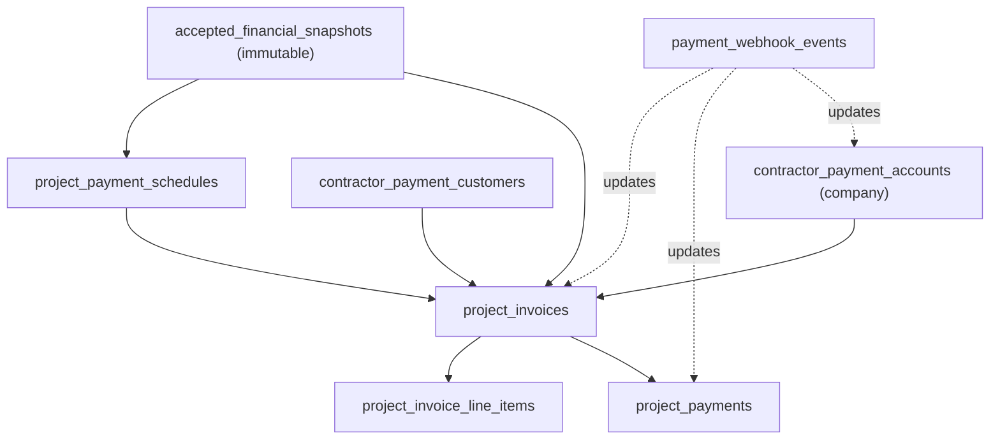
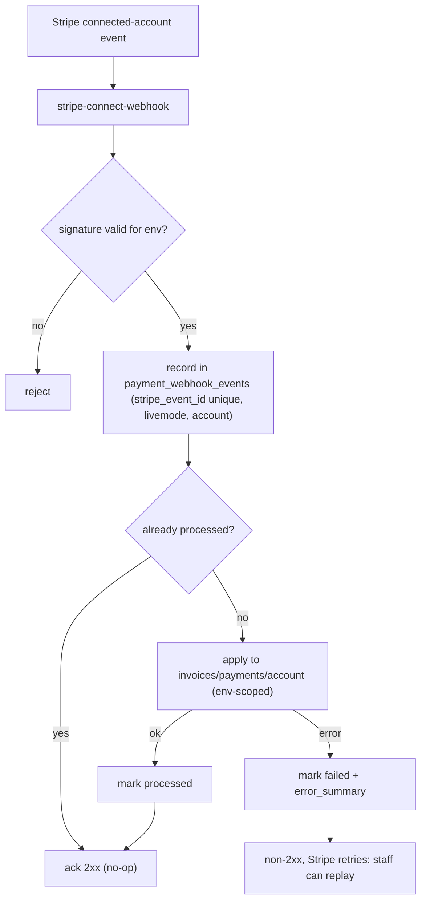

# Arden Payments — Proposal to Collection

Status: Review-only architecture plan. No production code, database migrations, Edge Functions, Stripe configuration, UI, or secrets are changed by this document.

Scope: An optional contractor-to-client payment-collection layer (Stripe Connect + Stripe Invoicing/Hosted Invoice Pages) that extends the existing emailed-proposal and project workflow. It is fully separate from Arden's own subscription billing.

Audience: Owner/founder review and engineering planning.

---

## Table of contents

1. Executive recommendation
2. Current-state audit
3. Existing workflow preservation map
4. Stripe Connect account-configuration evaluation
5. Charge / invoice model comparison and recommendation
6. Data model proposal
7. Security and privacy model
8. Entitlement / tier matrix
9. UX flows
10. Edge Function / API plan
11. Webhook / event handling plan
12. RLS and audit-log plan
13. Phased implementation roadmap
14. Testing strategy
15. Rollback and migration strategy
16. Risks, legal/compliance questions, and open decisions
17. Decisions Required From Owner
18. Appendix A: Decision table (recommended defaults)

---

## 1. Executive recommendation

Arden should add contractor-client payment collection as an optional, post-acceptance capability layered on top of the existing proposal system, not as a replacement for any current flow.

Confirmed design pillars:

- Keep emailed proposals and client acceptance exactly as they are today. Payments become available only after a proposal is accepted (or an approved change order exists) and only if the contractor has connected a payment account.
- Keep sensitive contractor banking/KYC data on Stripe via Stripe-hosted onboarding. Arden stores only opaque Stripe IDs, capability/status flags, timestamps, and display-safe state.
- Keep Arden subscription billing (the contractor paying Arden) and contractor-client payments (the client paying the contractor) as two isolated systems: separate tables, separate Stripe account context, separate webhook endpoint and signing secret, separate env vars, separate lookup-key namespace.
- Payment amounts come from an immutable accepted-proposal or approved-change-order snapshot, never from a live, editable estimate/proposal.

Open decision (deliberately not pre-decided): the Stripe Connect account configuration (Standard vs Express vs Stripe's current Accounts v2 / controller-based configuration). This is a Phase 0 decision driven by Arden's desired control, support burden, fraud/dispute responsibility, and contractor ownership expectations. See Section 4.

Provisional implementation recommendations (independent of the account-type decision):

- Charge model: direct charges on the connected account (contractor is merchant of record), confirmed against the chosen account type for fees/refunds/chargebacks/reporting. Optional platform fee deferred to Phase 5.
- Collection method: Stripe Invoicing with Hosted Invoice Pages, tied to an accepted proposal / project / payment-schedule item / approved change order. Not generic reusable payment links.
- Webhooks: a separate `stripe-connect-webhook` Edge Function with its own signing secret.
- Onboarding: Stripe-hosted account links only, created for an authenticated user inside Arden; never emailed.
- Environment safety: every payment record is tagged with `stripe_livemode` and Stripe account context; test and live records are never mixed in financial totals.
- Customer isolation: Stripe Customers are scoped to the contractor's connected account. A client paying contractor A is not the same Stripe Customer as the same client paying contractor B.
- Arden-created payment rule: only Stripe objects created by Arden with Arden metadata are allowed to affect Arden project financials; unrelated invoices/payments created directly in a contractor's Stripe Dashboard are ignored by Arden webhooks.

---

## 2. Current-state audit

This section records what exists today so the new layer can extend without collision. All paths are relative to the repo root (`c:\dev\calc`).

### 2.1 Arden subscription billing (the contractor pays Arden)

Self-contained and must not be reused for contractor-client payments.

- Edge Functions: `supabase/functions/create-checkout-session/index.ts`, `supabase/functions/create-customer-portal-session/index.ts`, `supabase/functions/create-usage-credit-checkout/index.ts`, `supabase/functions/stripe-webhook/index.ts`. Deprecated stub: `supabase/functions/create-portal-session/index.ts`.
- Shared Stripe client: `supabase/functions/_shared/stripe.ts` — `getStripe()` initializes `Stripe` at version `17.7.0`, API version `2024-11-20.acacia`, and includes `getOrCreateStripeCustomer()` operating on the `subscriptions` table.
- Tables: `public.subscriptions` (`20260706000000_subscriptions.sql`, hardened server-write-only in `20260717120000_subscriptions_server_write_only.sql`), `public.usage_credit_packs` (`20260717140000_usage_credit_packs.sql`), `public.subscription_email_events` (`20260718130000_subscription_email_events.sql`).
- Webhook behavior of note: `stripe-webhook` handles `checkout.session.completed`, `customer.subscription.*`, and—critically—`invoice.payment_failed` / `invoice.payment_succeeded`, which update `subscriptions` keyed by `stripe_customer_id` with no metadata filter. Any contractor invoice event arriving on this endpoint could mutate subscription state. This is the primary reason for a separate Connect webhook.
- Secrets/env (names only): `STRIPE_SECRET_KEY`, `STRIPE_WEBHOOK_SECRET`, `STRIPE_MODE`, `STRIPE_PUBLISHABLE_KEY`, `APP_URL`/`SITE_URL`, plus frontend `VITE_STRIPE_PUBLISHABLE_KEY`.
- Price identifiers use the `arden_*` lookup-key namespace (`src/lib/stripeConfig.ts`). Connect must use a distinct namespace.
- Frontend has no Stripe.js SDK; it redirects to hosted Checkout/Portal URLs via `src/services/billingService.ts`. Read path is `src/services/subscriptionService.ts` + `src/contexts/SubscriptionContext.tsx`.

### 2.2 Proposals, public access, and acceptance

- Table: `public.proposals` (`20250131000000_add_proposals_table.sql` and later) with `public_token`, `status` (`draft|sent|...|accepted|declined|deposit_paid|scheduled|paid`), denormalized `total_amount`/`deposit_amount`, and status timestamps (`sent_at`, `accepted_at`, `deposit_paid_at`, `paid_at`).
- Creation/persistence: `src/lib/proposalService.ts`, `src/lib/proposalSavePayload.ts`, `src/utils/proposalFinancials.ts` (`computeProposalFinancials` recomputes amounts on every save; default deposit 50%). UI: `src/pages/ProposalGenerator.tsx`.
- Email: `src/services/emailService.ts` -> `supabase/functions/send-transactional-email/index.ts` (Resend). The Edge Function mints `public_token` if missing and, on successful send, sets `status='sent'`, `sent_at`, `last_sent_to`. Templates in `supabase/functions/_shared/emailTemplates.ts` (`proposalSent`, `proposalFollowUp`, `depositRequest`, `clientCheckIn`). Email audit: `public.email_events` (`20260701000000_email_events.sql`).
- Public access (no login): RPC `get_proposal_by_public_token` (SECURITY DEFINER, redacts cost fields, returns NULL if `sent_at IS NULL`) and `record_proposal_client_action` (actions `viewed|opened|accepted|declined`). Defined/hardened in `20250527120000_proposal_tracking_and_financial_dashboard.sql` and `20260615000001_security_hardening_rls.sql`. Public page: `src/pages/PublicProposal.tsx` at route `/proposal/:token`.
- Important: acceptance only sets `status='accepted'` + `accepted_at`. There is no signature, no project auto-creation, and no immutable snapshot. `proposals.data`, `total_amount`, and `deposit_amount` remain editable after acceptance.

### 2.3 Client portal

- Table: `public.client_portals` (`20260531120000_client_portals.sql`), token-based, no anon SELECT; public reads go through `supabase/functions/client-project-portal/index.ts` (service role) which builds a safe payload via `supabase/functions/_shared/clientPortalBuilder.ts` (already exposes a derived `paymentStatus` label). Page: `src/pages/ClientPortal.tsx` at `/client/project/:token`.

### 2.4 Change orders and contracts

- Change orders: `public.change_orders` (`20260603000000_far_documentation_change_orders.sql` and later). Statuses `draft|sent|viewed|accepted|declined|void` (`src/types/changeOrder.ts`). On accept, `apply_accepted_change_order_to_project()` updates project rollups `projects.base_contract_value`, `approved_change_order_total`, `current_contract_value`. No immutable amount snapshot exists; the row stays editable after accept.
- Contracts: `public.contract_documents` + append-only `public.contract_document_versions` with an update-blocking trigger (`20260614000000_contract_documents.sql`, `20260615000000_contract_public_signing.sql`). This is the immutability pattern Arden Payments should imitate for financial snapshots.

### 2.5 Accounting exports and entitlements

- Exports: `src/utils/accountingExport.ts` aggregates proposals/change-orders/projects; `src/utils/quickbooksExport.ts` is a CSV-only (no Intuit API) pattern with `build*CsvContent()` + `download*Csv()` and shared helpers in `src/utils/accountingExportFormatting.ts`. Page: `src/pages/AccountingTaxPage.tsx` (gated `accounting_exports`, Business).
- Entitlements: `src/lib/entitlements.ts` defines plan IDs `free|starter|professional|business`, `PLAN_FEATURES`, `PLAN_LIMITS`. Gating via `src/contexts/SubscriptionContext.tsx` (`hasFeature`), `src/components/subscription/GatedLazyRoute.tsx`, `src/components/subscription/FeatureGate.tsx`, and server-side `src/services/featureEntitlementService.ts`. Settings link-out pattern in `src/pages/Settings.tsx` (Billing -> `/settings/billing` via `BillingPage.tsx`).
- No contractor payments / A/R / invoice ledger exists today. Closest primitives are the manual proposal statuses `deposit_paid`/`paid` (`src/lib/proposalTracking.ts`).

### 2.6 Collision risks to design around

1. Shared webhook endpoint (`stripe-webhook`) with unscoped `invoice.*` handlers.
2. Shared `STRIPE_SECRET_KEY` / `getStripe()` / `STRIPE_WEBHOOK_SECRET`.
3. `subscriptions.stripe_customer_id` conflating who pays Arden vs who pays the contractor.
4. `arden_*` lookup-key namespace.
5. Generically named subscription Edge Functions.

---

## 3. Existing workflow preservation map

The following must remain behaviorally unchanged. Payments are additive only.

| Existing asset | File / object | Preservation rule |
| --- | --- | --- |
| Proposal email send + sent-marking | `supabase/functions/send-transactional-email/index.ts` | Do not change `sent_at`/`public_token` minting or status transitions. Payment emails are separate sends. |
| Public proposal read redaction | `get_proposal_by_public_token` | Do not weaken redaction. Payment data is exposed only through new payment-scoped reads. |
| Proposal acceptance semantics | `record_proposal_client_action` (`accepted`) | Keep setting `status='accepted'` + `accepted_at`. Add snapshot capture as an additive write; never auto-charge on accept. |
| `depositRequest` email template | `supabase/functions/_shared/emailTemplates.ts` | Keep meaning as "please pay" with a proposal link. Do not repurpose for hosted-invoice delivery; add new template keys instead. |
| Manual paid markers | `markDepositPaid` / `markPaid` (`src/lib/proposalTracking.ts`) | Keep for manual/offline tracking; migrate gradually, do not delete. |
| Client portal payload builder | `supabase/functions/_shared/clientPortalBuilder.ts` | Extend `paymentStatus` from new payment tables; do not break existing fields. |
| Public proposal/contract/CO links and tokens | routes `/proposal/:token`, `/contract/:token`, `/change-order/:token` | No existing links, tokens, PDFs, or acceptance records are invalidated. Existing accepted proposals are eligible for payment enablement without recreation. |
| Arden subscription billing | `subscriptions`, `stripe-webhook`, `_shared/stripe.ts`, `arden_*` keys | Untouched. No shared tables, secrets, account context, or lookup keys. |

---

## 4. Stripe Connect account-configuration evaluation

Decision status: OPEN. This is a Phase 0 decision. Do not lock a Connect account type until Arden's intended responsibility model and Stripe's current platform-profile guidance are evaluated.

Evaluate three configurations:

- Stripe Connect Standard — contractor owns a full Stripe account and full Stripe Dashboard; Stripe owns more of the account relationship and support; positioned for SaaS/invoicing platforms where the connected business already operates independently.
- Stripe Connect Express — Stripe-hosted onboarding with an Express Dashboard; Arden gets more in-product control and reporting flexibility but takes on more operational responsibility (including dispute/fraud handling depending on charge model).
- Stripe's current Accounts v2 / controller-based configuration — Stripe's newer guidance expresses control via explicit controller properties (losses, fees, dashboard, requirement collection) rather than the legacy fixed type labels. Evaluate whether expressing controller properties directly better fits Arden than choosing a legacy preset.

Required decision-comparison table (to be concluded during Phase 0):

| Decision area | Standard | Express | Required conclusion for Arden |
| --- | --- | --- | --- |
| Contractor ownership/control | Highest | Moderate | Decide which best fits Arden's contractors (independent businesses vs platform-managed). |
| Stripe Dashboard | Full Stripe Dashboard | Express Dashboard | Decide what contractors should manage directly vs inside Arden. |
| Hosted onboarding / KYC | Stripe-managed | Stripe-managed | Confirm: Arden never collects identity, banking, tax, or card data in either case. |
| Arden support burden | Lower | Higher | Identify support and dispute expectations Arden is willing to staff. |
| Fraud / dispute responsibility | Analyze against chosen charge model | Analyze against chosen charge model | Do not assume contractor responsibility merely because payments settle to them; confirm against direct-charge semantics. |
| Direct charges | Supported | Supported | Confirm merchant-of-record, fees, refunds, chargebacks, and reporting behavior for the chosen type. |
| Future platform fee / reporting control | Limited / moderate | Greater | Decide whether added control is worth the added operational responsibility. |

Guidance: Standard tends to minimize Arden's support and liability burden and maximizes contractor ownership; Express (or a controller-based configuration) gives Arden more in-product control and reporting at the cost of higher operational responsibility. The final recommendation belongs to the owner (see Section 17).

Fixed regardless of account type:

- Stripe-hosted onboarding is mandatory; Arden creates account links only for an authenticated user in-product and never emails them.
- Arden stores only opaque Stripe IDs, capability/status flags, country/currency, requirements status, timestamps, and display-safe state.

---

## 5. Charge / invoice model comparison and recommendation

### 5.1 Charge model

| Model | Merchant of record | Funds flow | Notes |
| --- | --- | --- | --- |
| Direct charge (recommended) | Connected account (contractor) | Charge created on the connected account; settles to contractor | Cleanest match for "payments pay the contractor"; optional `application_fee_amount` later. Confirm dispute/refund/reporting against chosen account type. |
| Destination charge | Platform (Arden) | Charge on platform, transfer to contractor | Increases Arden's merchant-of-record and dispute exposure; not preferred for V1. |
| Separate charges + transfers | Platform | Most complex | Overkill for V1; defer. |

Recommendation: direct charges on the connected account, created with the connected-account context (`Stripe-Account` header). Validate fees, refund behavior, chargeback liability, and reporting against the Section 4 account-type choice before launch.

### 5.2 Collection method

Recommendation: Stripe Invoicing with Hosted Invoice Pages as the V1 collection experience. Do not use generic reusable payment links as the primary construction workflow.

Every payment request must be tied to: an accepted proposal, a project, a payment-schedule item, and an approved change order where applicable.

V1 payment-request types: deposit invoice, manual progress invoice, final invoice, approved change-order invoice.

Hosted Invoice Page URL handling (important):

- The Hosted Invoice Page is generated and secured by Stripe and surfaced via `hosted_invoice_url`. The URL is not a permanent forever-link.
- Arden must retrieve the current payment URL from Stripe (or current invoice state) rather than treating a stored link as permanently valid.
- Arden must never place a Stripe Account Link (onboarding) URL in any email.

Manual / offline payment tracking is always available (cash, check, wire/ACH outside Stripe, external processor, other) and never fabricates a Stripe payment object.

---

## 6. Data model proposal

Decision: adopt the seven-table ledger model (Option B) and add the required connected-account customer map. The two additional tables beyond the originally listed five are `accepted_financial_snapshots` (immutable amount source of truth) and `project_invoice_line_items` (line-level auditability). Option B is recommended because line-level invoice records, credits/refunds, future QuickBooks export, and change-order traceability all benefit from first-class records rather than opaque JSON blobs.

Supporting tables required for implementation:

- `contractor_payment_customers` maps Arden clients to Stripe Customers on each contractor's connected account.
- `company_payment_settings` stores company defaults for due terms, reminder cadence, accepted methods, payment instructions, and deposit due-on-receipt behavior.

All tables live in a dedicated payments domain. Do not reuse `subscriptions` or any subscription table. Names are proposals, not final DDL.

Environment boundary (applies to every table below): each row carries `stripe_livemode boolean not null` and a Stripe account context (`stripe_connected_account_id` where applicable). Financial reporting filters on `stripe_livemode = true`. Test-mode rows are never summed into live project revenue.

### 6.1 contractor_payment_accounts

One per contractor company. Stores only opaque/non-sensitive Stripe state.

- `id`, `company_id`
- `stripe_connected_account_id` (opaque)
- `account_type` (`standard | express | controller_v2`) and/or controller property summary
- `onboarding_status` -> maps to `ContractorPaymentAccountStatus` (`not_connected | onboarding_started | pending_verification | enabled | restricted | disabled`)
- `charges_enabled`, `payouts_enabled` (capability flags)
- `country`, `default_currency`, `requirements_status` (display-safe summary only)
- `stripe_livemode`
- `created_at`, `updated_at`

Never store bank account numbers, card data, identity documents, tax IDs, verification documents, or raw onboarding payloads.

### 6.2 accepted_financial_snapshots

Immutable source of truth for payable amounts. Written once when a proposal is accepted or a change order is approved; never updated (enforced by trigger, mirroring `contract_document_versions`).

- `id`, `company_id`, `project_id`
- `source_type` (`proposal | change_order`)
- `proposal_id` nullable, `change_order_id` nullable
- `snapshot_json` (frozen client-safe financial copy: accepted amount, line items, exclusions, allowances, tax, currency, accepted date, proposal revision, approved change-order additions, source IDs)
- `total_amount`, `deposit_amount`, `currency`
- `checksum`, `source_version`
- `created_by`, `created_at`
- (no `updated_at`; append-only)

Payment creation reads amounts only from here, never from live `proposals.data` / `computeProposalFinancials` or a live `change_orders.total`.

### 6.3 contractor_payment_customers

Stripe Customers are scoped to the connected account. Do not put one global `stripe_customer_id` on a client record.

- `id`
- `company_id`
- `client_id`
- `stripe_connected_account_id`
- `stripe_customer_id`
- `livemode`
- `email_at_creation`
- `created_at`
- `archived_at` nullable

Unique key: `(company_id, client_id, stripe_connected_account_id, livemode)`.

### 6.4 company_payment_settings

Company-level contractor payment defaults. These are separate from Arden subscription settings.

- `company_id`
- `default_due_terms`
- `reminder_cadence`
- `default_accepted_methods` (default: card + ACH)
- `payment_instructions`
- `deposits_due_on_receipt`
- `created_at`, `updated_at`

### 6.5 project_payment_schedules

- `id`, `project_id`
- `proposal_id` nullable, `accepted_snapshot_id` nullable (FK -> accepted_financial_snapshots)
- `schedule_type` (`deposit | progress | final | change_order`)
- `sequence`, `label`
- `amount_type` (`fixed | percentage`), `amount`, `percentage` nullable
- `due_date` nullable
- `status` (`planned | invoiced | paid | void`)
- `created_by`, `created_at`, `updated_at`

A schedule may be created before or after acceptance. No charge occurs automatically when a proposal is accepted.

Schedule defaults:

- Deposit: default 10%, editable/removable.
- Progress: manually created milestones only.
- Final: remaining approved balance.
- Change order: standalone invoice or added to the next request.

### 6.6 project_invoices

- `id`, `project_id`
- `proposal_id` nullable, `change_order_id` nullable, `payment_schedule_id` nullable
- `accepted_snapshot_id` (FK -> accepted_financial_snapshots; the immutable amount basis)
- `stripe_connected_account_id`, `contractor_payment_customer_id`, `stripe_customer_id`, `stripe_invoice_id`
- `hosted_invoice_url` (treated as non-permanent; refresh from Stripe/invoice state)
- `currency`, `subtotal`, `tax`, `total`, `amount_paid`, `balance_due`
- `status` (`draft | open | sent | processing | paid | partially_paid | void | uncollectible | refunded | disputed`)
- `immutable_snapshot_json` (frozen copy of what was billed)
- `stripe_livemode`
- `created_at`, `updated_at`
- Duplicate-prevention: a unique/guard constraint so a single `payment_schedule_id` cannot have more than one non-void open Stripe invoice at a time (see Section 11.4).

### 6.7 project_invoice_line_items

Line-level records for auditability, credits, and exports.

- `id`, `project_invoice_id`
- `description`, `quantity`, `unit_amount`, `amount`
- `source_ref` (e.g. snapshot line id, change-order line id)
- `tax_amount` nullable
- `sort_order`
- `created_at`

### 6.8 project_payments

- `id`, `project_invoice_id`
- `stripe_payment_intent_id` nullable, `stripe_charge_id` nullable
- `payment_method_type` (`card | us_bank_account | manual_*`)
- `amount`, `currency`
- `status` (`succeeded | pending | failed | refunded | partially_refunded`)
- `paid_at` nullable
- `source` (`stripe | manual`)
- `manual_reference` nullable, `recorded_by` nullable (for offline payments)
- `stripe_livemode`
- `created_at`, `updated_at`

Never store client payment cards, ACH credentials, or banking data.

Manual payments are append-only. Corrections create reversal/adjustment records, never silent edits or deletes.

### 6.9 payment_webhook_events

- `id`
- `stripe_event_id` (unique; idempotency key)
- `connected_account_id` nullable (top-level connected-account identifier from the event)
- `event_type`
- `payload_hash`
- `stripe_livemode`
- `processing_status` (`received | processed | failed | ignored`)
- `processed_at` nullable
- `error_summary` nullable
- `created_at`

### 6.10 Entity relationships

---

## 7. Security and privacy model

### 7.1 Data minimization

- Arden stores only opaque Stripe IDs, capability/status flags, country/currency, requirements status summary, timestamps, and display-safe state.
- Prohibited in Arden storage: bank account numbers, card details, ACH credentials, identity/verification documents, SSN/EIN/tax IDs, and raw Stripe onboarding payloads.
- Onboarding and client payment entry happen on Stripe-hosted surfaces. Arden never renders card or bank entry fields.

### 7.2 Account Link and Hosted Invoice URL handling

- Account Link (onboarding) URLs are created only for an authenticated contractor inside Arden and are never emailed, logged in plaintext audit, or shared.
- Hosted Invoice Page URLs (`hosted_invoice_url`) are treated as non-permanent. Arden refreshes the current URL from Stripe / invoice state before presenting a pay action and does not rely on a stored link being valid indefinitely.

### 7.3 Environment / livemode boundary (mandatory)

Production Connect webhook endpoints can receive both live and test events. To prevent test payments from appearing as real revenue:

- Every `contractor_payment_accounts`, `project_invoices`, `project_payments`, `payment_webhook_events`, and audit row records `stripe_livemode` and the Stripe account context (connected account id where applicable) plus the originating `stripe_event_id` where applicable.
- Rules:
  - Test-mode events and payments must never affect live project financial reporting.
  - Live and test payment records must never be combined in the same financial totals.
  - Webhook signature validation, idempotency, and replay handling are scoped to the correct environment (live secret verifies live; test secret verifies test).
  - Admin/support tooling visibly labels test vs live payments.
- All financial rollups (project balance due, A/R, exports) filter to `stripe_livemode = true` by default.

### 7.4 Separation from subscription billing

- Use the existing platform Stripe secret key for Connect API calls, scoped with the contractor's `Stripe-Account` context. Do not create a fake second Connect secret key.
- Add a dedicated `STRIPE_CONNECT_WEBHOOK_SECRET` for the isolated incoming Connect webhook endpoint; never reuse `STRIPE_WEBHOOK_SECRET`.
- New lookup-key namespace (e.g. `arden_payments_*`) if any products/prices are needed; never resolved by subscription plan logic.
- No contractor-client record is ever written to `subscriptions`, `usage_credit_packs`, or `subscription_email_events`.

### 7.5 Arden-created payment metadata

Every Stripe invoice/payment object Arden creates must include metadata sufficient to prove ownership and route webhook events:

- `arden_company_id`
- `arden_project_id`
- `arden_project_invoice_id`
- `arden_financial_snapshot_id`
- `arden_source = arden_project_os`

The Connect webhook ignores any invoice, payment, refund, dispute, or charge event that does not contain this metadata or cannot be matched to an Arden invoice/snapshot in the same connected account and livemode. This prevents unrelated payments a contractor creates directly in their own Stripe account from appearing in Arden project financials.

---

## 8. Entitlement / tier matrix

Reuse the existing mechanism in `src/lib/entitlements.ts` (plan IDs `free|starter|professional|business`), gated via `SubscriptionContext.hasFeature`, `GatedLazyRoute`, `FeatureGate`, and server-side `featureEntitlementService`. Add new `FeatureKey`s:

- `payments_manual_tracking`
- `payments_online`
- `payments_advanced`
- `payments_refunds`
- `payments_financial_reporting`

| Capability | Starter | Professional | Business |
| --- | --- | --- | --- |
| Estimates, proposals, acceptance, project/client records | Yes | Yes | Yes |
| Manual/offline payment tracking | Yes | Yes | Yes |
| Online payment collection (Connect onboarding) | No | Yes | Yes |
| Deposit / progress / final / change-order online invoices | No | Yes | Yes |
| Stripe Hosted Invoice Pages | No | Yes | Yes |
| Client payment history, project balance due, basic receivables | No | Yes | Yes |
| A/R aging | No | No | Yes |
| Payment schedule templates | No | No | Yes |
| Collection/financial permissions (role-based) | No | No | Yes |
| Advanced cash-flow / receivables reporting | No | No | Yes |
| Refund / credit-note workflow | No | No | Yes |
| Accounting/tax exports, QuickBooks export | No | No | Yes |
| Portfolio-level financial dashboard | No | No | Yes |

Proposed key-to-plan mapping: `payments_manual_tracking` in Starter+; `payments_online` in Professional+; `payments_advanced`, `payments_refunds`, and `payments_financial_reporting` in Business.

Role permissions:

- Owner/admin: connect Stripe, send/void invoices, refund, alter schedules.
- Financially permitted employee: record manual payment or draft invoice only.
- Client: view/pay only through a public invoice or portal route.

Enforce entitlements and role permissions in both UI and Edge Functions.

Caveat: do not market or gate these features in production until the existing entitlement model and actual production readiness are verified. Treat this matrix as a recommendation, not a release commitment.

---

## 9. UX flows

A separate Settings -> Payments area is added (link-out pattern mirroring `/settings/billing` in `src/pages/Settings.tsx`). Billing & Subscription remains for Arden subscription billing only.

### 9.1 Contractor

1. Uses Arden normally with payments not enabled. Estimating, proposals, projects, contracts, scheduling, and field workflows are unaffected.
2. Opens Settings -> Payments.
3. Chooses "Connect payments with Stripe" (with a clear "Skip for now").
4. Completes or exits Stripe-hosted onboarding (account link created in-product).
5. Returns to Arden; sees account state (`not_connected | onboarding_started | pending_verification | enabled | restricted | disabled`) and any required action.
6. From an accepted proposal/project, optionally creates a payment schedule and sends a deposit request.
7. Watches payment status update in project financials.

If a contractor attempts to send an online payment request without an enabled account, Arden does not block the proposal/project workflow and shows an inline prompt: "Online payments require a connected Stripe account. Connect Stripe to send this payment request." Manual tracking remains available.

Settings -> Payments V1 surface:

- `Connect with Stripe`
- `Skip for now`
- `Continue Stripe setup`
- Connection status
- `Charges enabled` and `Payouts enabled`
- `Action required in Stripe` state
- Stripe branding/setup guidance

Account Links are single-use and expire. They are generated only for an authenticated owner inside Arden and are never emailed or stored as permanent links.

### 9.2 Client

1. Receives the existing Arden proposal email and accepts through the current process (unchanged).
2. After acceptance, receives a payment request (delivery model per Section 10.0) or sees it in the client portal.
3. Opens the Stripe-hosted invoice page.
4. Pays with an enabled method (card / ACH).
5. Receives a Stripe payment confirmation/receipt.
6. Arden project portal updates payment status (live-mode only).

### 9.3 Offline payment

1. Contractor records a check/cash/wire payment with reference number, date, amount, and note.
2. Project balance and payment timeline update.
3. No Stripe payment object is fabricated; the record is `source = manual`.

### 9.4 Project financial and client portal surfaces

Payment data should feed:

- proposal/project financial summary
- invoice list
- payment timeline
- amount paid
- balance due
- deposit status
- change-order billing status
- client portal payment history

The client portal shows Stripe's current Hosted Invoice Page only for an Arden-created invoice associated with that client/project token.

---

## 10. Edge Function / API plan

### 10.0 Phase 0 decision — payment-request delivery model

Owner must choose one default sender for V1 to avoid duplicate client emails:

- Option 1: Stripe sends the invoice email directly (Stripe's invoice email contains the Hosted Invoice Page).
- Option 2: Arden sends a branded payment-request email containing the Stripe Hosted Invoice Page link (Stripe email suppressed).
- Option 3: Hybrid / manual resend (e.g. Arden default, with an explicit manual "resend via Stripe" action).

Rules:

- Do not send both by default. Pick one default sender for V1.
- Existing Arden proposal email delivery is preserved exactly as-is. Payment requests are separate communications that occur only after acceptance.
- Hosted Invoice Page URLs are secure, Stripe-generated, and may expire. Arden retrieves a current payment URL from Stripe/invoice state rather than treating a stored link as permanent.
- Arden never uses a Stripe Account Link (onboarding) URL in email.

V1 default recommendation: Stripe sends the invoice email directly. This uses the contractor connected account's Stripe invoice branding/details and avoids custom Resend sending domains for every contractor. Arden can still surface the current `hosted_invoice_url` in the project/client portal for the matching Arden-created invoice.

### 10.1 Function inventory

All functions are new and namespaced under `payments-*` (plus the separate webhook). Each requires an authenticated contractor (JWT via the existing `requireAuth` pattern) except the webhook, which is signature-verified.

| Function | Purpose |
| --- | --- |
| `payments-create-connect-account` | Create the connected account for the company. |
| `payments-create-connect-onboarding-link` | Create a Stripe-hosted account link for in-product onboarding. |
| `payments-get-connect-status` | Refresh capability/requirements/status flags from Stripe. |
| `payments-create-client-customer` | Create/find the client Stripe Customer on the connected account. |
| `payments-create-project-invoice` | Create a draft invoice + line items from an immutable snapshot. |
| `payments-send-project-invoice` | Finalize/send invoice; resolve delivery per Section 10.0. |
| `payments-void-project-invoice` | Void an open invoice (explicit replacement/void action). |
| `payments-record-manual-payment` | Record an offline payment (no Stripe object). |
| `payments-create-refund-request` | Initiate a refund/credit note (Business tier). |
| `stripe-connect-webhook` | Connected-account event ingestion (separate endpoint + secret). |

### 10.2 Per-function specification

For every function, the implementation must define: authentication requirement, company ownership check, entitlement check, source of truth, idempotency key strategy, validation rules, Stripe account context, allowed return URLs, error behavior, and audit logging.

- `payments-create-connect-account`
  - Auth: contractor JWT. Ownership: caller is owner of `company_id`. Entitlement: `payments_online`.
  - Source of truth: `contractor_payment_accounts`. Idempotency: one account per company (guard on existing `stripe_connected_account_id`).
  - Validation: company has no enabled account already. Account context: platform creates connected account. Return URLs: n/a. Error: surface restricted/duplicate clearly. Audit: account created with `stripe_livemode`.
- `payments-create-connect-onboarding-link`
  - Auth: contractor JWT. Ownership: company owner. Entitlement: `payments_online`.
  - Source of truth: Stripe account link. Idempotency: short-lived link, safe to regenerate. Account context: connected account. Return URLs: only Arden allow-listed return/refresh URLs (`/settings/payments`). Error: handle expired/again. Audit: link generated (URL not stored/emailed).
- `payments-get-connect-status`
  - Auth: contractor JWT. Ownership: company owner. Entitlement: `payments_online`.
  - Source of truth: Stripe account retrieve -> persist capability/status flags. Idempotency: read-only sync. Account context: connected account. Audit: status delta recorded.
- `payments-create-client-customer`
  - Auth: contractor JWT. Ownership: project belongs to company. Entitlement: `payments_online`.
  - Source of truth: `contractor_payment_customers` + Customer on the connected account; persist `stripe_customer_id` scoped to `(company_id, client_id, stripe_connected_account_id, livemode)`. Idempotency: reuse existing customer for the client/project/connected account. Validation: client email/name from project. Account context: connected account.
- `payments-create-project-invoice`
  - Auth: contractor JWT. Ownership: project + snapshot belong to company. Entitlement: `payments_online`.
  - Source of truth: `accepted_financial_snapshots` only (never live proposal/CO). Idempotency: key on `(payment_schedule_id, snapshot_id)`; refuse a second open invoice for the same schedule item unless prior is void (Section 11.4). Validation: amount/currency match snapshot; account `charges_enabled`; Stripe invoice metadata includes `arden_company_id`, `arden_project_id`, `arden_project_invoice_id`, `arden_financial_snapshot_id`, and `arden_source = arden_project_os`. Account context: connected account. Audit: invoice + line items created with `stripe_livemode`.
  - If account not enabled: return the inline-prompt condition (no hard block of project workflow).
- `payments-send-project-invoice`
  - Auth: contractor JWT. Ownership: invoice belongs to company. Entitlement: `payments_online`.
  - Source of truth: `project_invoices`. Idempotency: sending is idempotent (re-send re-fetches a fresh `hosted_invoice_url`, does not create a new invoice). Delivery: per Section 10.0 default. Account context: connected account. Return URLs: Arden allow-list. Audit: send logged in `email_events`-style record.
- `payments-void-project-invoice`
  - Auth: contractor JWT. Ownership: invoice belongs to company. Entitlement: `payments_online`.
  - Source of truth: `project_invoices`. Idempotency: voiding an already-void invoice is a no-op. Validation: cannot void a paid invoice (use refund). Account context: connected account. Audit: void reason recorded.
- `payments-record-manual-payment`
  - Auth: contractor JWT. Ownership: invoice/project belongs to company. Entitlement: `payments_manual_tracking`.
  - Source of truth: `project_payments` (`source = manual`). Idempotency: guard on `manual_reference` per invoice. Validation: amount <= balance due unless overpayment allowed. Account context: n/a (no Stripe object). Audit: `recorded_by`.
- `payments-create-refund-request`
  - Auth: contractor JWT. Ownership: payment/invoice belongs to company. Entitlement: `payments_advanced`.
  - Source of truth: Stripe refund/credit note + `project_payments`. Idempotency: Stripe idempotency key per refund attempt. Validation: refundable amount. Account context: connected account. Audit: refund recorded with environment tag.

---

## 11. Webhook / event handling plan

### 11.1 Separate endpoint (decided)

Connected-account payments use a dedicated `stripe-connect-webhook` Edge Function with its own signing secret (e.g. `STRIPE_CONNECT_WEBHOOK_SECRET`). Rationale:

- Connected-account events carry a top-level connected-account identifier (`event.account`) used for routing.
- The existing `stripe-webhook` mutates `subscriptions` on unscoped `invoice.payment_succeeded` / `invoice.payment_failed` keyed by customer id. Routing Connect invoice events through it risks corrupting subscription state. A separate endpoint removes that risk entirely.

### 11.2 Events to handle (connected account)

- `account.updated` -> refresh `contractor_payment_accounts` capability/requirements/status flags.
- `invoice.finalized`, `invoice.sent` -> update `project_invoices.status`, refresh `hosted_invoice_url`.
- `invoice.paid` / `invoice.payment_succeeded` -> create/settle `project_payments`, update `amount_paid`/`balance_due`/`status`.
- `invoice.payment_failed` -> record failure on the invoice/payment, surface to contractor (never touches `subscriptions`).
- `invoice.voided` / `invoice.marked_uncollectible` -> update invoice status.
- payment success/failure events -> reconcile asynchronous payment methods and processing state.
- `charge.refunded` / `credit_note.created` -> update `project_payments` refund state.
- dispute events -> move affected invoices/payments to `disputed` and notify the contractor.
- payout failures -> surface contractor account/payout action required without altering project revenue already recognized from paid invoices.

ACH and other asynchronous payment methods cannot be treated as paid from browser redirects. Authoritative project balance changes come from webhooks.

### 11.3 Environment scoping

- Each event records `stripe_livemode` (from `event.livemode`), `connected_account_id` (from `event.account`), `stripe_event_id`, and `event_type` in `payment_webhook_events`.
- The live signing secret verifies live events; the test secret verifies test events. Test events update only test-tagged rows and never affect live financial reporting.

### 11.3.1 Arden-created event filter

Before applying any connected-account event to project financials, the webhook must confirm:

- the event has the connected account id expected for the project invoice,
- the event livemode matches the Arden invoice livemode,
- the Stripe invoice/payment/charge metadata contains `arden_source = arden_project_os`,
- `arden_project_invoice_id` and `arden_financial_snapshot_id` match persisted Arden rows.

If the metadata is missing or does not match, record the event as ignored (idempotently) and do not mutate invoices, payments, project balances, or client portal status.

### 11.4 Delivery / retry safeguards (mandatory)

- Durable-first acknowledgement: the webhook records the event durably in `payment_webhook_events` (with `stripe_event_id` unique) before acknowledging. Only after durable idempotency recording is a 2xx returned.
- Idempotent processing: re-delivery of the same `stripe_event_id` is detected and short-circuited (no double-applied payments).
- Retryable failures: a processing failure sets `processing_status = failed` with `error_summary`, returns a non-2xx so Stripe retries, and is visible to authorized staff for manual replay.
- Idempotent payment-request sending: `payments-send-project-invoice` re-sending does not create a new invoice; it re-fetches a current `hosted_invoice_url`.
- Duplicate-invoice prevention: a `project_payment_schedules` item cannot create more than one non-void open `project_invoices` row. Creating a replacement requires an explicit void/replace action.

### 11.5 Flow

---

## 12. RLS and audit-log plan

### 12.1 Access rules

- Company/team scope: all payment tables are scoped by `company_id`/`project_id`; contractors access only their company's rows via RLS (mirror existing owner-scoped policies on `proposals`/`change_orders`). Server writes use the service role only inside Edge Functions.
- Client-facing boundary: clients never get direct table access. Client-visible payment status flows only through the existing token-based `client-project-portal` Edge Function payload (extend `clientPortalBuilder.ts`), and through Stripe-hosted pages. No payment table is exposed to `anon`.
- Server-write-only: like `subscriptions`, payment-state tables (`project_invoices`, `project_payments`, `contractor_payment_accounts`, `payment_webhook_events`) should be written only by Edge Functions, not the client.

### 12.2 Idempotency and immutability

- `payment_webhook_events.stripe_event_id` unique constraint is the webhook idempotency key.
- `accepted_financial_snapshots` is append-only with an update-blocking trigger (mirroring `contract_document_versions` / `prevent_contract_version_update`).
- `project_invoices.immutable_snapshot_json` freezes what was billed.

### 12.3 Audit history

- A payments audit log records actor, action, environment (`stripe_livemode`), connected account id, and related ids for: account connect/disconnect, invoice create/send/void, manual payment recorded, refund requested. Account Link and Hosted Invoice URLs are never stored in plaintext audit.

---

## 13. Phased implementation roadmap

### Stripe Dashboard work outside Cursor

Cursor cannot complete these dashboard/operator tasks; they must be done by the owner/operator before real contractor accounts are created:

- Enable/configure Connect in test mode first.
- Lock the dashboard/controller configuration before creating real contractor accounts; dashboard type is permanent for an account.
- Enable card and ACH payment methods for connected-account invoices.
- Create the separate Connect webhook endpoint and signing secret.
- Configure Arden branding for contractor onboarding.
- Let each contractor configure their own business name, logo, support information, and invoice branding in their Stripe account.

### Phase 0 — Audit and decisions (no implementation)

- Audit current proposals, public tokens, contract flows, Stripe subscriptions, entitlements, client portal, accounting exports (captured in Sections 2-3).
- Decide: Connect account configuration (Standard / Express / controller-based), charge model (provisional: direct), payment-request delivery model (Section 10.0), launch geography/currency (provisional: US/USD), supported payment methods.
- Identify legal/terms/privacy updates (contractor payments terms, client receipts, dispute responsibility disclosure).

### Phase 1 — Payment account connection

- Optional Stripe Connect onboarding (hosted), Settings -> Payments area, connected-account status, skip-now / connect-later UX.
- `contractor_payment_accounts` + `account.updated` handling. No client charging yet.

### Phase 2 — Proposal accepted to deposit request

- `accepted_financial_snapshots` capture (additive write on accept), `project_payment_schedules`, deposit invoice creation, Stripe Hosted Invoice Page, connected-account webhooks, project payment timeline, manual payment recording.

### Phase 3 — Construction billing workflow

- Progress invoices, final invoices, approved change-order invoices, reminders, balance due, client portal payment history.

### Phase 4 — Financial control

- A/R aging, invoice and payment reporting, credit/refund workflow, accounting/tax exports, QuickBooks-compatible export (CSV-only pattern from `src/utils/quickbooksExport.ts`).

### Phase 5 — Optional advanced integration

- QuickBooks sync evaluation, payment schedule templates, role-based financial approvals, optional platform-fee strategy, multi-currency/international evaluation (only after launch stability).

### Correct build order

1. Payments settings + optional Stripe connection + account-status webhook.
2. Accepted proposal snapshot + connected customer map + payment schedule.
3. Deposit invoice + Stripe email + client payment + webhook payment state.
4. Manual payments + project balance/timeline.
5. Progress/final/change-order invoices.
6. Business A/R, refunds, exports, permissions, QuickBooks work.

Do not start A/R dashboards, refund UI, QuickBooks, or custom contractor-branded email infrastructure until the deposit invoice loop is live and reliable.

---

## 14. Testing strategy

- Unit: snapshot immutability (writes once, update blocked), amount sourced from snapshot not live proposal, schedule/invoice math, entitlement gating per tier.
- Idempotency: duplicate webhook delivery applies once; re-send of a payment request does not create a second invoice; schedule item cannot open two live invoices.
- Environment: test events never alter live rollups; live and test totals never mix; admin tooling labels environment.
- Webhook: signature validation per environment; durable-first ack; failed processing retried and replayable.
- Stripe test-mode payment fixtures and a separate Connect webhook local-forwarding test command.
- Workflow preservation regression: existing proposal email send, public read redaction, and acceptance behavior unchanged (extend existing tests in the proposal/email suites).
- Export: payments export columns and CSV-only guardrails (mirror `quickbooksExport.test.ts`).
- Manual/offline: manual payment updates balance without any Stripe object.
- Observability: audit trail for every invoice, payment, void, refund, dispute, and status transition.

## 15. Rollback and migration strategy

- Additive migrations only; new tables and new nullable columns. No destructive change to `proposals`, `change_orders`, `subscriptions`, or existing RPCs.
- Snapshot capture is an additive branch inside acceptance; if disabled, acceptance behaves exactly as today.
- Feature-flag/entitlement gating allows disabling the entire payments layer without affecting non-payment features.
- Connect webhook is a new endpoint; removing it cannot affect the subscription webhook.
- Backfill: existing accepted proposals can have snapshots generated on demand at first payment-enablement (no recreation of proposals/tokens).
- Rollback path: disable entitlement keys + unregister the Connect webhook; payment tables remain inert and isolated.

## 16. Risks, legal/compliance questions, and open decisions

- Connect account type determines dispute/fraud responsibility; do not assume contractor liability merely because funds settle to them. Confirm against the chosen charge model.
- Legal/terms: contractor payment terms, client receipt/refund policy, and dispute-handling disclosures need legal review before launch.
- Tax: Arden does not file/remit tax; exports are business records, not verified bank payments (keep existing accounting disclaimers).
- Hosted Invoice URL expiry must be handled (refresh from Stripe), or clients may hit dead links.
- Multi-environment safety is a correctness risk if `livemode` tagging is missed anywhere.
- Geography/currency beyond US/USD is out of scope until post-launch.

## 17. Decisions Required From Owner

1. Connect account configuration — Choose whether Arden prioritizes lowest contractor-payment support burden (likely Standard) or greater in-product control/reporting flexibility with higher operational responsibility (likely Express or current controller-based configuration). No final Connect account-type claim is made until this is decided against Stripe's current platform guidance and Arden's intended responsibility model.
2. Charge model — confirm direct charges on the connected account (provisional recommendation) vs alternatives, including dispute/refund/chargeback ownership.
3. Payment-request delivery model — Stripe sends the invoice email directly, Arden sends a branded email with the Hosted Invoice Page link, or hybrid/manual resend. Choose one default sender for V1 (recommended: Stripe sends the invoice email directly).
4. Launch geography/currency — confirm US / USD for V1.
5. Supported payment methods — confirm card + ACH (`us_bank_account`) for V1.
6. Platform fee — confirm no platform fee at launch (defer to Phase 5).
7. Invoice reminders — confirm Stripe automatic reminders plus optional Arden nudges, avoiding duplicate client emails.
8. Payment schedule defaults — confirm default 10% deposit, manual progress milestones only, final remaining approved balance, and standalone/next-request change-order billing behavior.
9. Stripe Dashboard/operator setup — confirm Connect test-mode setup, account/dashboard/controller configuration, card/ACH methods, Connect webhook endpoint, and branding are complete before real contractor accounts.
10. Tier gates — confirm Starter (manual tracking only), Professional (online collection), Business (advanced receivables/exports), and the new feature keys, pending entitlement and production-readiness verification.

---

## Appendix A: Decision table (recommended defaults)

| Decision | Recommended default for V1 | Status |
| --- | --- | --- |
| Connect account configuration | No fixed default — evaluate Standard vs Express vs controller-based (Accounts v2) in Phase 0 | Open (owner decision) |
| Charge model | Direct charges on the connected account (contractor = merchant of record) | Provisional |
| Collection method | Stripe Invoicing + Hosted Invoice Pages | Recommended |
| Payment-request delivery | Stripe sends the invoice email directly; one sender only | Provisional (owner decision) |
| Launch country / currency | United States / USD | Provisional |
| Supported payment methods | Card + ACH (`us_bank_account`) | Provisional |
| Trial / platform fee | No platform fee at launch | Provisional |
| Invoice reminders | Stripe automatic reminders + optional Arden nudge (no duplicates) | Provisional |
| Payment schedule defaults | Deposit default 10% (editable/removable) + manual progress milestones + final remaining approved balance | Provisional |
| Webhook architecture | Separate `stripe-connect-webhook` + dedicated signing secret | Decided |
| Environment boundary | `stripe_livemode` on every account/invoice/payment/webhook/audit row; live and test never mixed | Decided |
| Data model | Seven-table ledger model (Option B) plus `contractor_payment_customers` and `company_payment_settings` supporting tables | Decided |
| Starter gate | Manual/offline payment tracking only | Recommended |
| Professional gate | Connect onboarding + online deposit/progress/final/CO invoices + hosted pages + basic receivables | Recommended |
| Business gate | A/R aging, schedule templates, financial permissions, refunds/credit notes, accounting/QuickBooks export, portfolio dashboard | Recommended |
